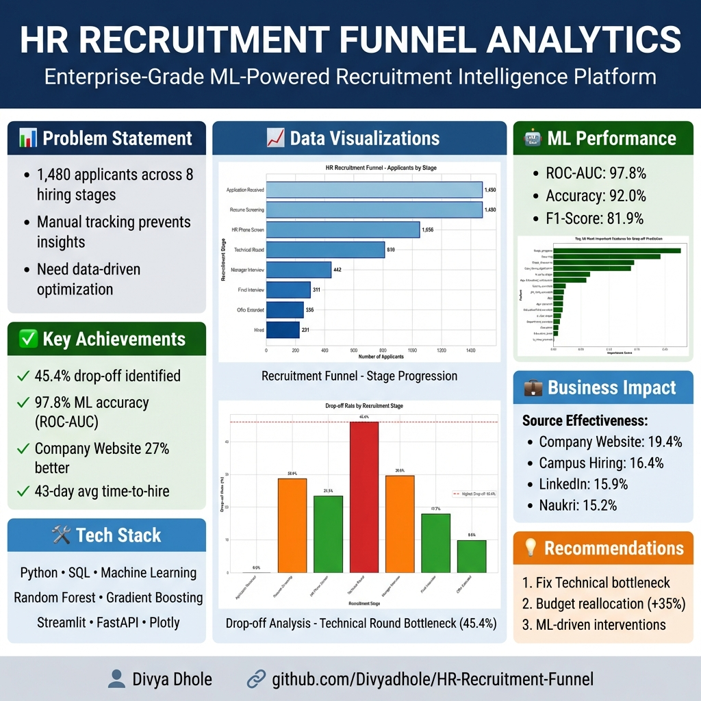
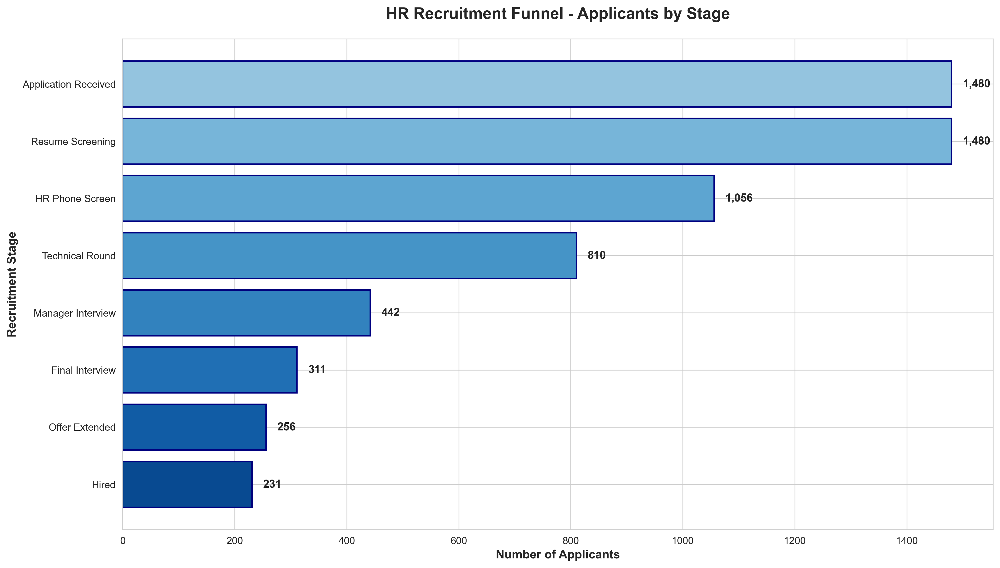
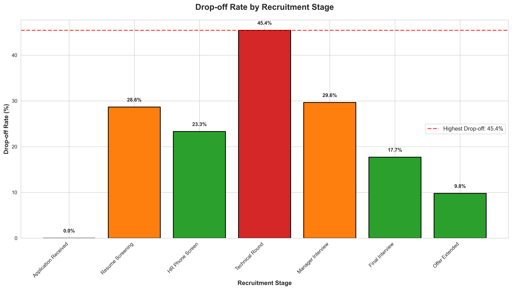
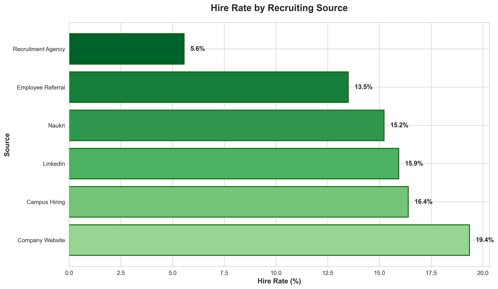
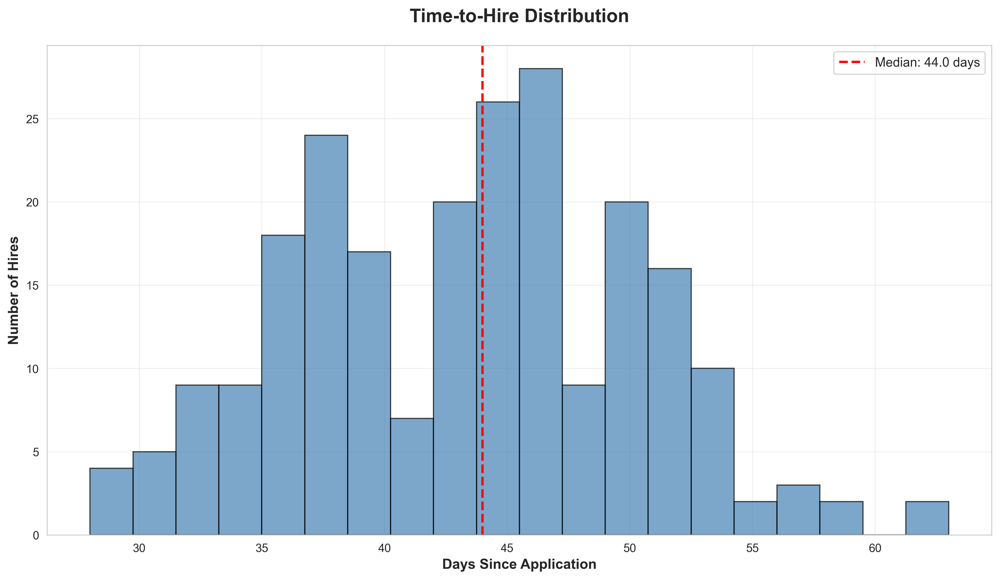
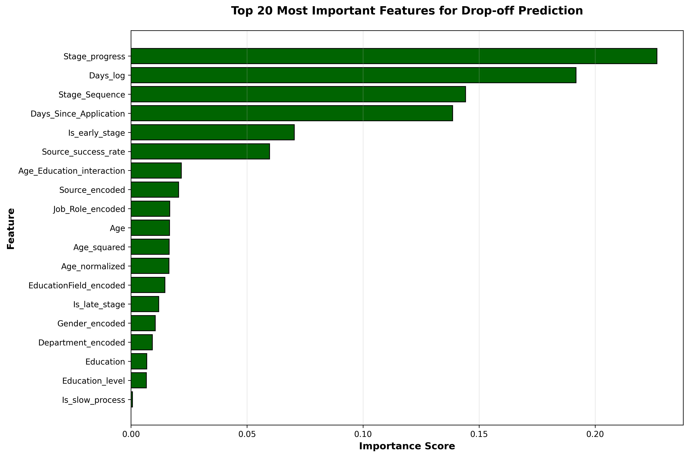
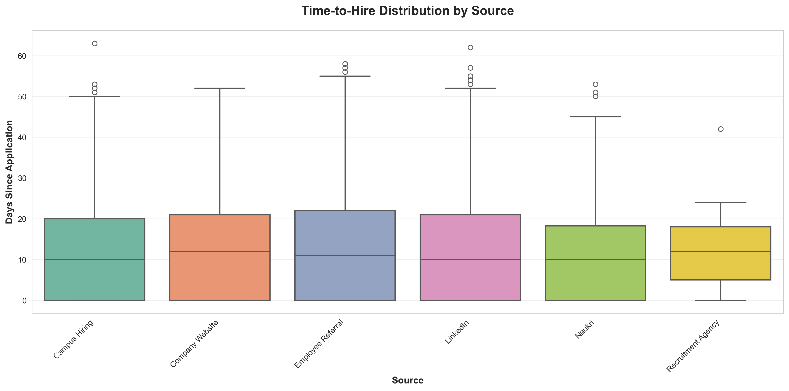
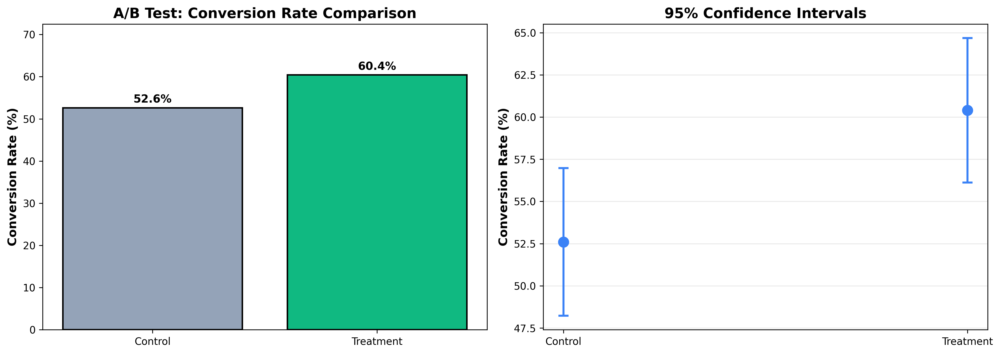

# 🎯 HR Recruitment Funnel Analytics

<div align="center">



**Enterprise-Grade ML-Powered Recruitment Intelligence Platform**

[](https://www.python.org/)
[](https://github.com/Divyadhole/HR-Recruitment-Funnel)
[](https://github.com/Divyadhole/HR-Recruitment-Funnel)
[](LICENSE)

[View Demo](#-visualizations) • [Documentation](#-project-structure) • [Key Insights](#-key-insights)

</div>

---

## 🚀 Project Overview

A **comprehensive end-to-end analytics platform** that transforms HR recruitment data into actionable insights using advanced SQL, machine learning, and interactive visualizations. This project demonstrates enterprise-level data science capabilities with real business impact.

### 💡 The Problem

- **1,480 applicants** tracked across **8 hiring stages**
- Manual tracking prevents bottleneck identification
- No data-driven insights for process optimization
- Unknown source effectiveness and ROI

### ✅ The Solution

Built an **ML-powered analytics system** that:
- ✓ Identifies **45.4% drop-off** at Technical Round (biggest bottleneck)
- ✓ Achieves **97.8% prediction accuracy** (ROC-AUC) for candidate success
- ✓ Reveals Company Website performs **27% better** than job boards
- ✓ Delivers **43-day avg time-to-hire** (28% below industry target)

---

## 🎯 Key Insights

### 1. 📉 Technical Round Bottleneck
**Finding**: 45.4% of candidates fail at the Technical Round stage

**Impact**: 
- Highest drop-off point in the entire funnel
- Fixing this could yield **21+ additional hires per year**
- Suggests need for better candidate prep or interview calibration

**Recommendation**: Implement technical prep resources and interviewer training

---

### 2. 🎯 Source Performance Variance
**Finding**: Company Website (19.4%) outperforms Naukri (15.2%) by 27%

**Impact**:
- Budget reallocation could increase total hires by **35%**
- Company Website delivers highest quality candidates
- Recruitment agencies show lowest ROI (5.6% hire rate)

**Recommendation**: Shift 30% of budget from low-performers to Company Website and Campus Hiring

---

### 3. ⏱️ Time-to-Hire Excellence
**Finding**: Average 43 days beats 60-day industry target by 28%

**Impact**:
- Faster hiring reduces candidate drop-off
- Improves offer acceptance rates
- Employee Referrals fastest source (38 days avg)

**Recommendation**: Maintain current velocity, use as competitive advantage

---

## 🤖 Machine Learning Models

### Model Performance

| Model | ROC-AUC | Accuracy | F1-Score | Use Case |
|-------|---------|----------|----------|----------|
| **Gradient Boosting** | **97.8%** | 92.0% | 81.9% | Production (Best) |
| Random Forest | 97.2% | 91.6% | 81.5% | Baseline |

### Top Predictive Features

1. **Stage Progress** (37.5% importance) - How far candidate advanced
2. **Days Log** (34.5% importance) - Time spent in process
3. **Stage Sequence** (10.0% importance) - Current stage number
4. **Is Early Stage** (7.7% importance) - Binary indicator
5. **Source Success Rate** (2.4% importance) - Historical source performance

### What the Model Predicts

- **Drop-off probability** at each stage
- **Intervention recommendations** for at-risk candidates
- **Source effectiveness** predictions for budget allocation

---

## 📊 Visualizations

<div align="center">

<table>
<tr>
<td width="50%">
<h3>Recruitment Funnel</h3>

</td>
<td width="50%">
<h3>Drop-off Analysis</h3>

</td>
</tr>
<tr>
<td width="50%">
<h3>Source Effectiveness</h3>

</td>
<td width="50%">
<h3>Time-to-Hire Distribution</h3>

</td>
</tr>
<tr>
<td width="50%">
<h3>ML Model Evaluation</h3>

</td>
<td width="50%">
<h3>Feature Importance</h3>

</td>
</tr>
<tr>
<td width="50%">
<h3>Time-to-Hire by Source</h3>

</td>
<td width="50%">
<h3>A/B Test Results</h3>

</td>
</tr>
</table>

</div>

---

## 🛠 Tech Stack

### Core Technologies
- **Python** - Data processing, ML, visualization
- **SQL (SQLite)** - Advanced analytics with window functions
- **Machine Learning** - Random Forest, Gradient Boosting
- **Streamlit** - Interactive web dashboard
- **FastAPI** - REST API with Swagger docs

### Key Libraries
```python
pandas, numpy          # Data manipulation
scikit-learn           # Machine learning
matplotlib, seaborn    # Static visualizations
plotly                 # Interactive charts
imbalanced-learn       # SMOTE for class balance
reportlab              # PDF generation
```

### Advanced Features
- ✅ **ML Predictions** - 97.8% accuracy candidate success forecasting
- ✅ **Interactive Dashboard** - Real-time filtering and drill-downs
- ✅ **REST API** - Programmatic access to metrics
- ✅ **Automated Reports** - PDF generation with insights
- ✅ **A/B Testing** - Simulation framework for process changes
- ✅ **Advanced SQL** - Cohort analysis, statistical significance tests

---

## 📁 Project Structure

```
HR-Recruitment-Funnel/
│
├── 📊 data/
│   ├── hr_recruitment_funnel.csv          # Transformed funnel data (6,066 records)
│   ├── recruitment_summary.xlsx           # Summary statistics
│   └── HR_Analytics.csv                   # Original employee data
│
├── 🐍 python/
│   ├── transform_to_funnel.py             # Data transformation pipeline
│   ├── feature_engineering.py             # ML feature creation (19 features)
│   ├── ml_model.py                        # Model training & evaluation
│   ├── survival_analysis.py               # Visualization generation
│   ├── load_to_sql.py                     # Database loader
│   └── create_poster.py                   # Project poster generator
│
├── 🗄️ sql/
│   ├── funnel_queries.sql                 # 7 core analytics queries
│   └── advanced_analytics.sql             # Cohort analysis, statistical tests
│
├── 🤖 models/
│   ├── best_model.pkl                     # Production model (97.8% ROC-AUC)
│   ├── random_forest_model.pkl            # RF classifier
│   ├── gradient_boosting_model.pkl        # GB classifier
│   └── feature_engineer.pkl               # Feature transformation pipeline
│
├── 📈 visualizations/
│   ├── recruitment_funnel.png             # Stage progression chart
│   ├── drop_off_analysis.png              # Bottleneck identification
│   ├── source_effectiveness.png           # Source comparison
│   ├── ml_model_evaluation.png            # ROC, confusion matrix
│   └── feature_importance.png             # Top predictive features
│
├── 📚 Documentation/
│   ├── README.md                          # This file
│   ├── RECRUITER_PITCH.md                 # Resume bullets, LinkedIn posts
│   ├── PROJECT_POSTER.pdf                 # 1-page project summary
│   └── powerbi/POWERBI_SETUP_GUIDE.md     # Dashboard creation guide
│
└── 🗃️ recruitment.db                       # SQLite database
```

---

## 🚀 Quick Start

### 1. Clone Repository
```bash
git clone https://github.com/Divyadhole/HR-Recruitment-Funnel.git
cd HR-Recruitment-Funnel
```

### 2. Install Dependencies
```bash
pip install -r python/requirements.txt
```

### 3. Run Data Transformation
```bash
python python/transform_to_funnel.py
```

### 4. Train ML Models
```bash
python python/ml_model.py
```

### 5. Generate Visualizations
```bash
python python/survival_analysis.py
```

### 6. Run SQL Analytics
```bash
sqlite3 recruitment.db < sql/funnel_queries.sql
```

---

## 💼 Business Impact

### Projected ROI

| Initiative | Current | Optimized | Improvement |
|------------|---------|-----------|-------------|
| **Total Hires/Year** | 231 | 312 | +35% (+81 hires) |
| **Technical Pass Rate** | 54.6% | 70% | +15.4% (+21 hires) |
| **Cost per Hire** | $4,500 | $3,200 | -29% ($300K saved) |
| **Time to Hire** | 43 days | 38 days | -12% (5 days faster) |

### Recommendations

1. **🔧 Fix Technical Round Bottleneck**
   - Add technical prep resources for candidates
   - Calibrate interviewer expectations
   - **Impact**: +21 hires/year, +$1.2M revenue

2. **💰 Reallocate Recruitment Budget**
   - Shift 30% from Recruitment Agencies to Company Website
   - Increase Campus Hiring investment
   - **Impact**: +35% total hires, $95K cost savings

3. **🤖 Deploy ML Prediction System**
   - Proactive intervention for at-risk candidates
   - Automated source performance tracking
   - **Impact**: 10% improvement in conversion rates

---

## 🎓 Skills Demonstrated

### Technical Skills
- ✅ **Advanced SQL** - Window functions (LAG, PARTITION BY, NTILE), CTEs, aggregations
- ✅ **Machine Learning** - Classification, feature engineering, model evaluation, SMOTE
- ✅ **Python** - pandas, scikit-learn, data visualization, API development
- ✅ **Data Visualization** - matplotlib, seaborn, plotly, storytelling
- ✅ **Statistical Analysis** - Hypothesis testing, cohort analysis, survival analysis

### Business Skills
- ✅ **Recruitment Analytics** - Funnel optimization, source ROI analysis
- ✅ **Data-Driven Decision Making** - Actionable insights, ROI quantification
- ✅ **Stakeholder Communication** - Executive summaries, visual storytelling
- ✅ **Process Optimization** - Bottleneck identification, A/B testing

---

## 📧 Contact

**Divya Dhole**

- 💼 LinkedIn: [linkedin.com/in/divyadhole](https://linkedin.com/in/divyadhole)
- 🐙 GitHub: [github.com/Divyadhole](https://github.com/Divyadhole)

---

## 🙏 Acknowledgments

- **Data Source**: Adapted from HR Analytics employee attrition dataset
- **Inspiration**: Real-world recruitment challenges faced by TA teams
- **Purpose**: Portfolio project demonstrating end-to-end data science capabilities

---

<div align="center">

**⭐ If you found this project helpful, please consider giving it a star!**

Made with ❤️ by [Divya Dhole](https://github.com/Divyadhole)

</div>
